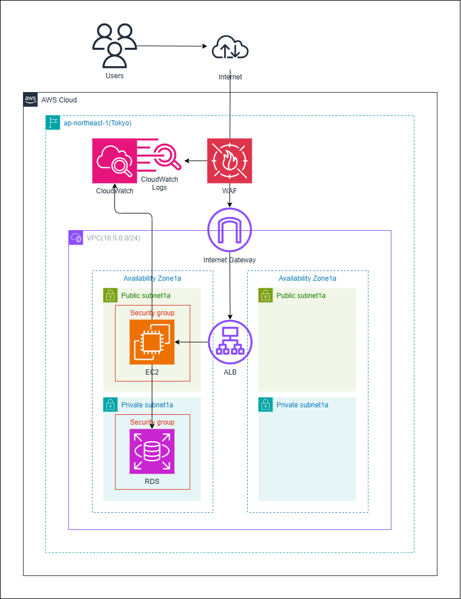

# AWSインフラ構築の学習記録

このリポジトリでは、CloudFormation・Terraform・Ansible・GitHub Actionsを用いて  
AWS上にインフラ環境を自動構築する一連の学習内容をまとめています。

---

## ① インフラ構成図

### 📘 内容
AWS上の基本構成（VPC / EC2 / RDS / ALB / WAF / CloudWatch）を設計。  
インターネット経由でアクセス可能なWebアプリケーション環境を構築しました。

### 💡 工夫したこと
- 最新のAWSアイコンを用いた構成図（draw.io）を使用  
- 各リソースの関連性を明確に整理
- CloudWatchへのメトリクス連携を図示して監視まで可視化  

### 📂 関連ファイル
- [インフラ構成図.drawio](./インフラ構成図.drawio)
- [インフラ構成図.png](./インフラ構成図.png)

---

## ② CloudFormationによるインフラ環境のコード化

### 📘 内容
AWSマネジメントコンソールで構築した環境をCloudFormationでコード化。
各リソースをテンプレート化し、再現性の高いインフラ環境構築を自動化。  

### 💡 工夫したこと
- 手動構築でリソース間の依存関係を理解したうえで、CloudFormationにより再現性の高い構成へ変換。
- パラメータ機能を活用し、環境ごとに設定値を柔軟に切り替えられるように設計。
- コード化によって再現性と保守性の向上を体験し、Infrastructure as Codeの基本を学習。

### 📂 関連ファイル
- [CloudFormation.yaml](./CloudFormation.yaml)

---

## ③ Terraformによるインフラ環境のコード化（IaC）

### 📘 内容
CloudFormationでの構築をもとに、Terraformでインフラ環境構築をコード化。
各リソースをTerraformで定義し、コマンド操作によってインフラ環境構築を自動化。 

### 💡 工夫したこと
- CloudFormationとの違いを意識しながら、モジュール構成でコードの再利用性を高めました。
- 変数や出力値を使い、設定や結果を整理して管理しやすくしました。
- モジュール構成による
- terraform fmt、validate、plan、applyの一連の操作で構築の流れを確認。
- S3をバックエンドで設定し、状態状態管理ファイル（tfstate）の仕組みを理解しました。

### 📂 関連ファイル
- [terraform/](./terraform/)

---

## ④ GitHub ActionsによるTerraform CI/CD

### 📘 内容
Terraformでコード化したインフラ構築をGitHub Actionsで自動化。
Terraformの実行をワークフローとして定義し、プルリクエストやマージをトリガーにterraform planやapplyによりインフラ環境構築を自動化しました。

### 💡 工夫したこと
- ワークフローをCI（plan）とCD（apply）で分けて管理し、構成を整理。
- pull_requestトリガーでCIを実行し、構成エラーを事前に検出。
- pushトリガーでmainブランチへのマージ後、自動的にCDを実行してインフラを構築。
- workflow_dispatchにより、手動での再実行にも対応。
- terraform destroy専用のワークフローを別途作成し、手動で環境削除を実行できるように設計。
- S3バックエンドを使用し、コード変更時にも再構築が正しく行われるように設計。
- AWSアクセスキーなどの認証情報をGitHub Secretsで安全に管理。

### ⚙️ ワークフロー構成

| Workflow | トリガー | 主な内容 |
|-----------|-----------|-----------|
| Terraform CI | プルリクエスト時 | init / fmt / validate / test / plan |
| Terraform CD | マージ時（mainブランチへプッシュでも可能） | apply による構築 |

### 📂 関連ファイル
- [.github/workflows/terraform-ci.yaml](.github/workflows/terraform-ci.yaml)
- [.github/workflows/terraform-cd.yaml](.github/workflows/terraform-cd.yaml)
- [.github/workflows/terraform-destroy.yaml](.github/workflows/terraform-destroy.yaml)

---

## ⑤ Ansibleによる構成管理とアプリ自動デプロイ

### 📘 内容
Ansibleを使用してEC2上の構成管理とアプリケーションの自動デプロイを実装。
JavaのインストールからSpring Bootアプリの配置・起動までを一連の流れとして自動化。
GitHub Actionsと連携し、Terraformによる環境構築完了後にAnsibleが自動で実行。

### 💡 工夫したこと
- ワークフローをCI（ドライラン）とCD（実行）で分けて管理し、デプロイ前に構成チェックの実施。
- Terraformの出力値からEC2パブリックIPを自動取得し、Ansibleのインベントリを動的生成。
- Javaを自動インストールし、Spring Bootアプリ（JARファイル）をGitHubからEC2へ転送し、バックグラウンド起動。
- workflow_dispatchにより、手動での再実行にも対応。
- SSH鍵やAWSアクセスキーなどの認証情報をGitHub Secretsで安全に管理。

### ⚙️ ワークフロー構成

| Workflow | トリガー | 主な内容 |
|-----------|-----------|-----------|
| Ansible CI | workflow_run (Terraform CD完了時) | 構文チェック・ドライラン |
| Ansible CD | workflow_run (Ansible CI完了時) | 実デプロイ・起動確認 |

### 📂 関連ファイル
- [.github/workflows/ansible-ci.yaml](.github/workflows/ansible-ci.yaml)
- [.github/workflows/ansible-cd.yaml](.github/workflows/ansible-cd.yaml)
- [ansible/playbook.yaml](./ansible/playbook.yaml)
- [ansible/app/demo.jar](./ansible/app/demo.jar)
